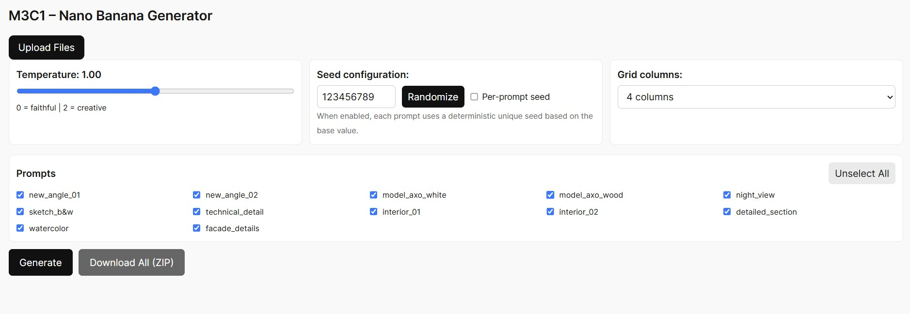

# M3C1 DIFFUSION - IMAGE GENERATOR



Powered by the Nano Banana API + Next.js - UPDATED TO RUN NANO BANANA PRO (gemini-3-pro-image-preview)

This app allows architects and designers to generate consistent AI-based architectural images including alternate views, diagrams and model studies, from one or more reference images.

Built for creative workflows at M3C1


## Features

- Custom AI pipeline using Nano Banana API + Gemini multimodal models

- Image-to-Image consistency for architectural references

- Multiple prompt presets (angles, diagrams, axonometric views, details, etc.)

- Seed control (deterministic outcomes are in test) 

- Automatic ZIP export of all generated outputs

- Next.js frontend for quick experimentation and visual feedback


## How It Works

- Upload one or more reference images of your project.

- Choose from a set of predefined prompts (35mm, 50mm, model, sketch, diagram, etc.).

- Optionally define a global or per-prompt random seed.

- Generate images via Nano Banana API.

- Download all results in a single ZIP - filenames include seed + prompt name.


## Installation

### Install Node.js

Before starting the project, make sure **Node.js** is installed on your computer.

Download it from the official website https://nodejs.org/

- Recommended version v22.21.0
- Keep the default options;
- Check **“Add to PATH”** so you can use Node from the terminal.

After installation, you can verify it by running:

```bash
node -v
npm -v
```

### Clone the repository

- Download the folder directly, or install Git: https://git-scm.com/downloads
- Open Command Prompt (cmd), PowerShell or Git Bash, then clone the repository:

```
git clone https://github.com/marcellacarone/m3c1-nano.git
```

- Enter m3c1-nano folder and install dependencies:

```
cd m3c1-nano
```

```
npm install
```
- Install the new Gemini SDK:

```
npm install @google/genai
```

- Run the app:

```
npm run dev
```

- Then visit http://localhost:3000


### Configuration

To configure your app, you must have a PAID GEMINI API KEY for nano banana, associated to a google cloud project and with billing setup. Probably you can get initial free credits to use it. 

- Create an API key in Google AI Studio: https://aistudio.google.com

After, follow the steps:

- create a LOCAL file **.env.local** in the root folder
- this file should contain your API KEY:

```
GEMINI_API_KEY=INSERT-YOUR-KEY-HERE
```

## Authors

Marcella Carone | @marcellacarone

@m3c1.com.br | São Paulo, Brazil
